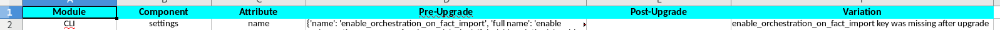

# ContentAnalsyer

Content Analyser tool helps to identify the variance between pre-upgrade and post-upgrade data.

<TODO>

How to run:

1: Copy the CLI, API and Templates module data before upgrade and after upgrade in the below files.
    
    a: preupgrade_cli
    b: preupgrade_api
    c: preupgrade_templates
    d: postupgrade_templates

2: Check the config file and update the details according to your use
    
       a: config.yml
       b: existence_test_data.yml

3: Execute the runner file

    python runner.py
    
4: Check the populated report in /report directory.

   